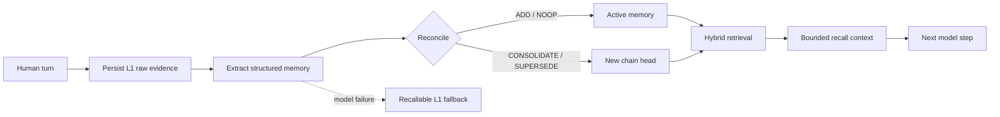

# @evyn/dsh-memory

> Durable, auditable cross-session memory for [DeepSeek Harness](https://github.com/deepseek-ai/deepseek-harness).

English | [简体中文](README.zh.md)

`@evyn/dsh-memory` is a native DeepSeek Harness plugin that gives agents long-term memory across Sessions. It captures durable user facts and identities, preserves their source evidence, reconciles duplicates and changing information without destructive overwrites, and recalls relevant context before the model answers.

The plugin is built directly on Harness-native lifecycle, LLM, Session, and storage primitives. The package includes both a trusted `ctx.memory` service and a narrow set of model-facing memory tools.

> [!IMPORTANT]
> This project is at `0.1.x`. The storage format and public API are usable and tested, but may evolve before a stable release.

## Features

- **Cross-session memory** — memories are owned by a tenant, user, and agent rather than by a single Session.
- **Raw-first durability** — source content is committed before fallible model extraction begins.
- **Structured memory layers** — stores basic profile, raw evidence, facts, summaries, and stable identities.
- **Non-destructive evolution** — duplicate, consolidated, and superseded facts retain provenance and revision links.
- **Hybrid retrieval** — combines a portable 256-dimensional hash vector, BM25, and reciprocal-rank fusion.
- **Automatic capture and recall** — integrates with Harness turn events without replacing the Session log.
- **Explicit model tools** — provides add, search, list, and forget operations with server-derived scope.
- **Graceful degradation** — a failed extraction leaves the raw L1 record durable and recallable.
- **Portable data** — trusted consumers can export and import validated records with embedding-space checks.

## How it works



Every write first persists an L1 raw record and a durable job. In extraction mode, the configured memory model then produces schema-validated JSON and reconciles it against records from the same owner. Successful enrichment creates structured records and keeps the raw source as provenance; failed enrichment returns a `degraded` receipt while leaving the raw source recallable.

Search filters ownership, visibility, status, validity, layer, and optional Session scope before ranking. Profile memories and normal memories have independent result budgets.

## Requirements

- DeepSeek Harness with an available chat model
- Node.js `^22.19.0` or `>=24.0.0`
- Durable Harness storage; the Web profile already provides it
- pnpm `11.7.0` when developing from source

## Quick start

### Install the plugin

Install a published or packed release into the Harness Web profile:

```sh
dsh plugin --profile web add @evyn/dsh-memory
dsh --profile web --dump-config
dsh --profile web
```

The bundled patch mounts the memory service and its tools, and uses the Web profile's currently selected default model for extraction and reconciliation.

To install directly from a Git revision:

```sh
dsh plugin --profile web add github:<owner>/dsh-memory#<commit-sha>
```

Git installs run the package `prepare` script. Follow the one-time pnpm build-authorization prompt reported by `dsh` if it appears.

### Configure it manually

Use an explicit model route when mounting the service yourself or overriding the bundled defaults:

```yaml
- name: '@evyn/dsh-memory'
  config:
    provider: deepseek
    model: deepseek-chat
    autoCapture: true
    autoRecall: true

- name: '@evyn/dsh-memory/tool'
```

For a headless or custom profile, mount these dependencies before the memory service:

- `dsh-agent`
- `dsh-llm`
- `dsh-storage`
- one storage backend
- `dsh-storage-domain`

Once enabled, ordinary conversation is enough. Completed human turns can be captured automatically, and relevant memories can be injected before a later answer. The agent can also use the explicit tools described below.

## Configuration

### Core options

| Option | Type | Default | Description |
| --- | --- | --- | --- |
| `provider` | `string` | required | LLM provider used for extraction and reconciliation. |
| `model` | `string` | required | Model ID used for extraction and reconciliation. |
| `userId` | `string` | Harness anonymous ID | Stable user identity for memory ownership. |
| `tenantId` | `string` | unset | Optional tenant namespace. |
| `autoCapture` | `boolean` | `true` | Extract durable memory when a direct-human turn stops. |
| `autoRecall` | `boolean` | `true` | Recall memory before a step containing direct user input. |

The bundled patch supplies `provider` and `model` from the current default-model selection. They remain required when the service is mounted directly.

### Limits and retrieval policy

| Option | Default | Description |
| --- | ---: | --- |
| `maxModelTokens` | `4096` | Maximum output tokens for each extraction or reconciliation call. |
| `maxInputChars` | `50000` | Maximum accepted source characters per write. |
| `maxRecordChars` | `4000` | Maximum characters retained in one derived record. |
| `recallLimit` | `8` | Maximum results in the normal recall channel. |
| `profileLimit` | `4` | Independently reserved profile results. |
| `maxContextChars` | `6000` | Maximum memory context injected into one model step. |
| `reconcileCandidateLimit` | `12` | Existing candidates shown to the reconciliation model. |
| `minSemanticScore` | `0.08` | Minimum hash-vector cosine score without a lexical match. |
| `rrfK` | `60` | Reciprocal-rank-fusion smoothing constant. |
| `bm25K1` | `1.5` | BM25 term-frequency saturation. |
| `bm25B` | `0.75` | BM25 document-length normalization. |
| `profileFields` | name, age, location, timezone, language, occupation | L0 profile keys the extractor may update. |

## Memory layers

| Layer | Purpose | Written by this provider |
| --- | --- | --- |
| `l0_basic_info` | Structured basic profile | Yes |
| `l1_raw` | Original source evidence | Yes, before enrichment |
| `l2_fact` | Events and changing facts | Yes |
| `l3_summary` | Model-produced summary | Yes |
| `l4_identity` | Stable preferences, traits, and identity | Yes |
| `l5_knowledge` | Reserved portable layer | No |
| `l6_schema` | Reserved portable layer | No |
| `l7_intention` | Reserved portable layer | No |

L5-L7 remain in the public type vocabulary for format compatibility, but the reference provider rejects writes and imports for those layers.

## Model-facing tools

Installing the bundle also mounts `@evyn/dsh-memory/tool`:

| Tool | Purpose |
| --- | --- |
| `memory_add` | Store one user-stated fact or stable identity. |
| `memory_search` | Search relevant cross-session memory with optional evolution history. |
| `memory_list` | Inspect recent memories, optionally filtered by layer or Session. |
| `memory_forget` | Soft-delete one exact memory after an explicit user request. |

Scope IDs are derived from the live owning Agent. The model cannot choose a tenant, user, agent, or Session ID. Bulk import and export remain available only through the trusted service API.

## Service API

The package root mounts `ctx.memory` and implements `MemoryCapability`:

```ts
const scope = ctx.memory.scopeFor(agent)

const receipt = await ctx.memory.add({
  scope,
  content: 'The user prefers TypeScript for backend services.',
  layer: 'l4_identity',
  tags: ['typescript', 'backend'],
  idempotencyKey: 'preference-typescript',
})

const result = await ctx.memory.search({
  scope,
  query: 'What language does the user prefer for backend work?',
  includeEvolution: true,
})
```

The complete capability includes:

- `scopeFor(agent)`
- `add(input, signal?)`
- `search(input, signal?)`
- `get(memoryId, scope)`
- `list(input)`
- `forget(memoryId, scope)`
- `export(scope)` / `import(scope, records)`
- `health()`

Public TypeScript types are exported from `@evyn/dsh-memory` and `@evyn/dsh-memory/types`.

## Identity, privacy, and model behavior

Memory ownership is keyed by `{tenantId, userId, agentId}`. The live `sessionId` is provenance and an optional read filter, so an agent can recall records from earlier Sessions without mixing different owners.

With automatic recall enabled, the plugin inserts a bounded, clearly delimited `<memory-recall>` user message before the current user message. It labels recalled records as fallible background and instructs the model to prefer the current request on conflict. The recall message is written through the normal Session surface, keeping the model-visible request reconstructable.

With automatic capture enabled, the non-tool transcript from the completed human turn is sent to the configured memory model as untrusted JSON data. Extraction does not alter the answer already in flight. A turn can add one extraction call and, when facts are found, one reconciliation call.

The default anonymous user ID is a local correlation identity, not authentication or authorization. Deployments handling sensitive or hostile content should provide an authenticated `userId`, review retention policy, and add policy filtering appropriate to their threat model.

## Current limitations

- The built-in hash embedding is portable and deterministic, but weaker than a trained multilingual embedding model.
- Tags participate in lexical text; there is no independent tag index.
- Each mutation atomically replaces one whole owner-state JSON row, which is not intended for very large corpora.
- Per-owner serialization is process-local; the storage domain does not provide cross-process compare-and-set.
- Extraction and reconciliation require exact JSON and fail closed on prose or malformed output.
- Automatic capture can add up to two model calls per completed human turn.
- The project does not yet provide authenticated subject mapping, a built-in retention policy, or writable L5-L7 semantics.

See [the design document](docs/design.md) for the architecture, behavioral guarantees, and rejected alternatives.

## Development

```sh
git clone <repository-url>
cd dsh-memory
pnpm install
pnpm typecheck
pnpm test
pnpm build
```

The test suite covers raw-first idempotent writes, cross-session retrieval, automatic recall, degraded extraction, reconciliation, evidence-aware forgetting, all four model tools, and persistence across a cold Loader restart.

## Contributing

Issues and pull requests are welcome. For behavior changes, please include tests and update both `README.md` and `README.zh.md` when user-facing documentation changes. Run `pnpm typecheck`, `pnpm test`, and `pnpm build` before opening a pull request.

## License

Released under the [MIT License](LICENSE).
