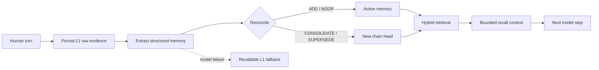

# @evyn/dsh-memory

> Durable, auditable cross-session memory for [DeepSeek Harness](https://github.com/deepseek-ai/deepseek-harness).

English | [简体中文](README.zh.md)

`@evyn/dsh-memory` is a native DeepSeek Harness plugin that gives agents long-term memory across Sessions. It captures durable user facts and identities, preserves their source evidence, reconciles duplicates and changing information without destructive overwrites, and recalls relevant context before the model answers.

The plugin is built directly on Harness-native lifecycle, LLM, Session, and storage primitives. The package includes both a trusted `ctx.memory` service and a narrow set of model-facing memory tools.

> [!IMPORTANT]
> This project is at `0.1.x`. The storage format and public API are usable and tested, but may evolve before a stable release.

## Features

- **Cross-session memory** — memories are owned by a tenant, user, and agent rather than by a single Session.
- **Raw-first durability** — source content is committed before fallible model extraction begins.
- **Structured memory layers** — stores basic profile, raw evidence, facts, summaries, and stable identities.
- **Non-destructive evolution** — duplicate, consolidated, and superseded facts retain provenance and revision links.
- **Pluggable hybrid retrieval** — combines either the portable hash space or a trained embedding provider with configurable CJK-aware BM25 and reciprocal-rank fusion.
- **Automatic capture and recall** — integrates with Harness turn events without replacing the Session log.
- **Explicit model tools** — provides add, search, list, and forget operations with server-derived scope.
- **Graceful degradation** — a failed extraction leaves the raw L1 record durable and recallable.
- **Portable data** — trusted consumers can export and import validated records with embedding-space checks.

## How it works



Every write first persists an L1 raw record and a durable job. In extraction mode, the configured memory model receives the complete output JSON Schema and produces schema-validated JSON. Unknown optional fields must be omitted rather than filled with null or placeholder values. Each extracted fact or identity gets its own same-layer, same-owner candidate shortlist; sources with no candidates become deterministic `ADD` operations without a reconciliation call. Successful enrichment creates structured records and keeps the raw source as provenance; failed enrichment returns a `degraded` receipt while leaving the raw source recallable.

Search filters ownership, visibility, status, validity, layer, and optional Session scope before ranking. Profile memories and normal memories have independent result budgets.

## Requirements

- DeepSeek Harness `0.1.5-rc.2` with an available chat model (the current peer/test target)
- Node.js `^22.19.0` or `>=24.0.0`
- Durable Harness storage; the Web profile already provides it
- pnpm `11.7.0` when developing from source

## Quick start

### Install the plugin

Install a published or packed release into the Harness Web profile:

```sh
dsh plugin --profile web add @evyn/dsh-memory
dsh --profile web --dump-config
dsh --profile web
```

The bundled patch mounts the memory service, its tools and the optional Web management consumer, and follows the Web profile's live default-model selection for each extraction write, including changes made in Settings after startup.

To install directly from a Git revision:

```sh
dsh plugin --profile web add github:<owner>/dsh-memory#<commit-sha>
```

Git installs run the package `prepare` script. Follow the one-time pnpm build-authorization prompt reported by `dsh` if it appears.

### Run with a local Harness and DashScope

This integration targets `0.1.5-rc.2`; the older `0.1.0-rc.7` pi-ai adapter does not expose the `supportsDeveloperRole` option required by this example. After updating an existing checkout, run `pnpm install --frozen-lockfile`, `pnpm clean`, and `pnpm build` in the Harness repository before installing the plugin.

From this repository, with a built Harness `0.1.5-rc.2` checkout next to it:

```sh
pnpm install
pnpm build
export DSH_HARNESS_DIR=/home/cyw/deepseek-harness
export DSH_HOME="$PWD/.local/harness-home"
node "$DSH_HARNESS_DIR/apps/cli/lib/bin.js" plugin --profile web add "$PWD"
node "$DSH_HARNESS_DIR/apps/cli/lib/bin.js" --profile web --patch "$PWD/examples/dashscope.patch.yml" --port 3080
```

Open the authenticated URL printed by Harness at startup (port `3080` here). A fresh browser request to the bare URL may return HTTP 401 until that link establishes a session. The local directory install links the built package; rebuild and restart after source changes. `.local/` holds this deployment's settings, sessions and memory. Reuse the same `DSH_HOME` across restarts. For an immutable package, run `pnpm pack --out /tmp/dsh-memory.tgz` and pass that tarball to `plugin ... add` instead.

The [DashScope overlay](examples/dashscope.patch.yml) reads `DASHSCOPE_API_KEY` and `DASHSCOPE_API_URL` from the launch environment and selects `qwen3.7-flash` for chat and memory extraction. The URL must be an OpenAI-compatible base URL, without `/chat/completions`. It uses Harness's `llm-pi-ai` adapter and keeps embeddings local. Its token limits are deployment bounds, not vendor maximum specifications. Existing saved model settings take precedence over the overlay; select `dashscope-memory / qwen3.7-flash` in Settings if reusing a home. Credentials are not written into the overlay.

To override an already installed bundle, pass a patch targeting `id: memory` with `config: { provider: ..., model: ... }` via `--patch`. Do not pass root Loader entries with `name` as a patch.

### Verify the complete integration

```sh
pnpm harness:smoke --harness /home/cyw/deepseek-harness
# Explicitly calls DashScope using the two environment variables above:
pnpm harness:smoke --harness /home/cyw/deepseek-harness --live
```

The script builds and packs the plugin, installs it through the real CLI into a temporary home, and runs two separate Harness processes. It checks tool registration/search, automatic extraction, persisted raw evidence, cross-session recall after cold restart, and Web HTTP 200. The default mode uses a fake LLM only; package installation may download dependencies. Live mode sends only synthetic conversations from an empty working directory. Both modes remove their temporary home and stop their Host processes. Ordinary `pnpm test` never needs external model credentials.

### Configure it manually

To pin extraction to a fixed model, specify both route fields. This is a root Loader configuration fragment:

```yaml
- name: '@evyn/dsh-memory'
  config:
    provider: deepseek
    model: deepseek-chat
    autoCapture: true
    autoRecall: true

- name: '@evyn/dsh-memory/tool'
```

For a headless or custom profile, mount these dependencies before the memory service:

- `dsh-agent`
- `dsh-llm`
- `dsh-storage`
- one storage backend
- `dsh-storage-domain`

Once enabled, ordinary conversation is enough. Completed human turns can be captured automatically, and relevant memories can be injected before a later answer. The agent can also use the explicit tools described below.

## Configuration

### Core options

| Option | Type | Default | Description |
| --- | --- | --- | --- |
| `provider` | `string` | current default | Fixed extraction provider; supply together with `model`, or omit both. |
| `model` | `string` | current default | Fixed extraction model; supply together with `provider`, or omit both. |
| `userId` | `string` | Harness anonymous ID | Stable user identity for memory ownership. |
| `tenantId` | `string` | unset | Optional tenant namespace. |
| `autoCapture` | `boolean` | `true` | Extract durable memory when a direct-human turn stops. |
| `autoRecall` | `boolean` | `true` | Recall memory before a step containing direct user input. |
| `embedding` | object | `{ kind: "hash" }` | Portable hash or OpenAI-compatible embedding configuration. |
| `tokenizer` | object | `{ kind: "cjk-bigram" }` | CJK-bigram or legacy BM25 tokenization policy. |

When both fields are omitted, the service reads `agentDefaultModel.currentSelection()` after persisting raw evidence. One write uses the same provider/model for extraction and reconciliation; later writes see Settings changes. Explicit pairs stay fixed. Partial or blank pairs are invalid. Without a default-model service, direct writes and reads still work; extraction returns a `degraded` receipt while preserving recallable raw evidence. The bundle declares `agentDefaultModel` as a dependency.

### Embedding providers

The default `HashEmbeddingProvider` is deterministic, offline, and preserves the existing `dsh-memory/hash-token-char-v1/256/l2` space. A loader deployment can opt into a trained OpenAI-compatible endpoint:

```yaml
- name: '@evyn/dsh-memory'
  config:
    provider: deepseek
    model: deepseek-chat
    embedding:
      kind: openai-compatible
      baseUrl: https://example.invalid/compatible-mode/v1
      apiKeyEnv: MEMORY_EMBEDDING_API_KEY
      model: multilingual-embedding-model
      spaceId: deployment/multilingual-embedding-model/1024/l2
      dimensions: 1024
      batchSize: 128
      timeoutMs: 30000
      maxRetries: 2
      retryBaseDelayMs: 100
```

`apiKeyEnv` names an environment variable; a literal key is rejected and the resolved public configuration never contains the key value. Programmatic consumers may instead supply an `embeddingProvider` implementing `EmbeddingProvider`. The programmatic and loader-configured entries are mutually exclusive.

The core batches sequentially to the advertised provider limit, restores input order, validates count/dimensions/finite non-zero values, and applies final L2 normalization. The reference remote adapter retries only network failures, HTTP 408/429/5xx, and per-attempt timeouts within its configured bounds. Caller cancellation is propagated unchanged.

### Lexical tokenization

The default `CjkBigramTokenizer` lowercases each ASCII alphanumeric run and splits each contiguous Basic Han run (`U+3400`–`U+9FFF`) into overlapping bigrams. A single Han character remains a one-character token; punctuation, whitespace, underscore, emoji, full-width Latin, and supplementary Han characters are delimiters. The implementation deliberately performs no Unicode normalization, stemming, stop-word removal, dictionary lookup, or synonym expansion.

Set `tokenizer: { kind: "legacy" }` to roll BM25 back to the pre-MEM-102 whole-Han-run behavior. This rollback changes no stored vector, embedding space, canonical record, or evolution relation. The versioned portable hash implementation always uses its private legacy token path, so selecting either lexical mode leaves `dsh-memory/hash-token-char-v1/256/l2` byte-for-byte unchanged.

Trusted programmatic consumers may instead inject a `lexicalTokenizer` implementing `LexicalTokenizer`; it is mutually exclusive with loader `tokenizer` configuration. Construction performs a redacted empty-input preflight. Runtime output must be an actual array of at most 100,000 non-empty strings, each at most 256 UTF-16 code units, and is copied immediately. Failures expose only `TOKENIZATION_FAILED` / `lexical tokenizer failed`. A custom tokenizer runs synchronously in-process and cannot be preempted if it loops forever, so it must be trusted and resource-bounded by its host.

### Limits and retrieval policy

| Option | Default | Description |
| --- | ---: | --- |
| `maxModelTokens` | `4096` | Maximum output tokens for each extraction or reconciliation call. |
| `maxInputChars` | `50000` | Maximum accepted source characters per write or query characters per search. |
| `maxRecordChars` | `4000` | Maximum characters retained in one derived record. |
| `recallLimit` | `8` | Maximum results in the normal recall channel. |
| `profileLimit` | `4` | Independently reserved profile results. |
| `maxContextChars` | `6000` | Maximum memory context injected into one model step. |
| `reconcileCandidateLimit` | `12` | Maximum existing candidates per extracted memory shown to reconciliation. |
| `minSemanticScore` | `0.08` | Minimum hash-vector cosine score without a lexical match. |
| `rrfK` | `60` | Reciprocal-rank-fusion smoothing constant. |
| `bm25K1` | `1.5` | BM25 term-frequency saturation. |
| `bm25B` | `0.75` | BM25 document-length normalization. |
| `profileFields` | name, age, location, timezone, language, occupation | L0 profile keys the extractor may update. |

## Memory layers

| Layer | Purpose | Written by this provider |
| --- | --- | --- |
| `l0_basic_info` | Structured basic profile | Yes |
| `l1_raw` | Original source evidence | Yes, before enrichment |
| `l2_fact` | Events and changing facts | Yes |
| `l3_summary` | Model-produced summary | Yes |
| `l4_identity` | Stable preferences, traits, and identity | Yes |
| `l5_knowledge` | Reserved portable layer | No |
| `l6_schema` | Reserved portable layer | No |
| `l7_intention` | Reserved portable layer | No |

L5-L7 remain in the public type vocabulary for format compatibility, but the reference provider rejects writes and imports for those layers.

## Model-facing tools

Installing the bundle also mounts `@evyn/dsh-memory/tool`:

| Tool | Purpose |
| --- | --- |
| `memory_add` | Store one user-stated fact or stable identity. |
| `memory_search` | Search relevant cross-session memory with optional evolution history. |
| `memory_list` | Inspect recent memories, optionally filtered by layer or Session. |
| `memory_forget` | Soft-delete one exact memory after an explicit user request. |

Scope IDs are derived from the live owning Agent. The model cannot choose a tenant, user, agent, or Session ID. Bulk import and export remain available only through the trusted service API.

## Service API

The package root mounts `ctx.memory` and implements `MemoryCapability`:

```ts
const scope = ctx.memory.scopeFor(agent)

const receipt = await ctx.memory.add({
  scope,
  content: 'The user prefers TypeScript for backend services.',
  layer: 'l4_identity',
  tags: ['typescript', 'backend'],
  idempotencyKey: 'preference-typescript',
})

const result = await ctx.memory.search({
  scope,
  query: 'What language does the user prefer for backend work?',
  includeEvolution: true,
})
```

The complete capability includes:

- `scopeFor(agent)`
- `add(input, signal?)`
- `search(input, signal?)`
- `get(memoryId, scope)`
- `list(input)`
- `forget(memoryId, scope, expectedRevision?)`
- `managementScopes()` / `inspect(scope)`
- `revise(input, signal?)`
- `export(scope)` / `import(scope, records)`
- `health()`

Public TypeScript types are exported from `@evyn/dsh-memory` and `@evyn/dsh-memory/types`.

## Identity, privacy, and model behavior

Memory ownership is keyed by `{tenantId, userId, agentId}`. The live `sessionId` is provenance and an optional read filter, so an agent can recall records from earlier Sessions without mixing different owners.

With automatic recall enabled, the plugin inserts a bounded, clearly delimited `<memory-recall>` user message before the current user message. It labels recalled records as fallible background and instructs the model to prefer the current request on conflict. The recall message is written through the normal Session surface, keeping the model-visible request reconstructable.

With automatic capture enabled, the non-tool transcript from the completed human turn is sent to the configured memory model as untrusted JSON data. Extraction does not alter the answer already in flight. A turn adds one extraction call and at most one reconciliation call; when every extracted source has an empty shortlist, deterministic `ADD` operations avoid the second call.

For a remote embedding space, an add still commits the recallable L1 raw record and accepted job before network I/O. That first commit uses a same-space, same-dimension zero placeholder. Successful enrichment replaces it with a validated vector; provider failure marks the job `degraded`, creates no derived records, and leaves the raw text available to lexical recall. Search invokes the provider and tokenizer only after owner/status/visibility/validity/layer/Session filtering and skips both when the candidate pool is empty. A non-cancellation provider outage disables only semantic ranking and reports `semantic:provider-unavailable`; a tokenizer failure disables only BM25 and reports `lexical:tokenizer-unavailable`; if both are unavailable, search returns empty channels with both diagnostics. Reconciliation filters active, recallable, currently valid records of the source's layer before provider/tokenizer work and does not use Session as a boundary. Non-empty source queries are embedded in bounded ordered batches; a failed batch disables semantic ranking only for its sources and later batches continue. Each source may fall back to lexical alone, or to semantic alone only when its query vector and at least one candidate vector are non-zero. If either channel remains available, its shortlist is still usable; if any non-empty source loses both channels, the whole accepted job degrades with the fixed redacted tokenizer error and no partial derived records. The model sees only sources with non-empty shortlists, a stable deduplicated candidate catalog, and source-specific target ids. Caller cancellation is never converted into fallback success.

Embedding vectors are deployment data sent to the configured endpoint. Choose an endpoint and retention policy appropriate for the sensitivity of memory content. Keys are read only from the named environment variable and are excluded from descriptors, errors, logs, and evaluation reports.

The default anonymous user ID is a local correlation identity, not authentication or authorization. Deployments handling sensitive or hostile content should provide an authenticated `userId`, review retention policy, and add policy filtering appropriate to their threat model.

## Memory management and diagnostics

After installing the bundle and restarting Harness, open **Settings → 记忆 (Memory)** to inspect the configured local owner's cross-session memory. Select an existing agent preset, filter by content/tags, layer and status, and browse paginated records, source evidence and version history. The default filter shows active records; deleted records remain accessible through the status filter.

- **Confirm** saves human confirmation as new raw evidence and a new revision of the current fact or identity/preference.
- **Correct** saves new content with reciprocal supersession links. Only active, recallable L2/L4 records can be revised; raw evidence cannot be overwritten.
- **Soft delete** stops recall after confirmation. Deleting source evidence also soft-deletes derived records that lose their last source. It does not erase historical data from disk.
- **Status and diagnostics** shows recallable/total records, completed/degraded writes, capture/recall settings and retrieval type. The last 30 durable jobs include duration, logical model-call counts and safe error codes; unavailable legacy metadata remains blank. The last 20 automatic recall attempts list only actually injected IDs, drawn from a global process-local buffer capped at 200 events and cleared on restart.

In-progress jobs omit unfinished call counts. Recovered interrupted jobs retain start/recovery timestamps but report duration and call count as unknown, so downtime is never presented as processing time.

The page refreshes on demand and after successful mutations; it does not poll. Writes check the whole owner-scope revision, so intervening writes require a refresh. Confirmation/correction makes no extraction-model calls, but an external embedding provider still receives the new evidence and revision content. Embedding failure keeps the old memory active and the durable raw evidence recallable, with a degraded receipt.

Harness Connection protects the `/api/memory-management/*` RPC channel with its login cookie, Host and Origin checks. The browser selects only server-listed presets and cannot supply tenant/user/session identities. Responses omit vectors, arbitrary metadata, raw job warnings and provider exception bodies. Memory content and evidence are intentionally visible to the authenticated local administrator. This uses local deployment ownership; it does not implement multiuser authenticated identity mapping.

Trusted APIs add `managementScopes()`, `inspect(scope)` and `revise({scope, memoryId, expectedRevision, action, content?, idempotencyKey})`; `forget(memoryId, scope, expectedRevision?)` optionally checks the scope revision. These APIs add no model tools. The `/management` Host entry activates only when `memory`, `connection` and `webServer` are available; headless compositions retain the service and existing tools.

The real browser smoke uses an isolated temporary `DSH_HOME`, no external models, and checks packaged installation, authentication, isolation, UI mutations and cold restart:

```sh
# Install Playwright Chromium from the Harness checkout; system browser libraries are required.
node "$DSH_HARNESS_DIR/apps/web/node_modules/playwright/cli.js" install chromium
pnpm harness:management-smoke --harness "$DSH_HARNESS_DIR"
```

## Current limitations

- The built-in hash embedding is portable and deterministic, but weaker than a trained multilingual embedding model.
- One non-empty store may contain only its active embedding `spaceId` and dimension. Switching provider/model/dimensions/normalization requires a new `spaceId`; MEM-101 rejects a cold switch or foreign import and does not perform re-embedding. Migration is reserved for MEM-104.
- Tags participate in lexical text; there is no independent tag index.
- A trusted custom tokenizer is a synchronous in-process extension; its output is bounded, but an implementation that never returns cannot be interrupted at the call boundary.
- Each mutation atomically replaces one whole owner-state JSON row, which is not intended for very large corpora.
- Per-owner serialization is process-local; the storage domain does not provide cross-process compare-and-set.
- Extraction and reconciliation require exact JSON and fail closed on prose or malformed output.
- Automatic capture can add up to two model calls per completed human turn.
- The project does not yet provide authenticated subject mapping, a built-in retention policy, or writable L5-L7 semantics.

See [the design document](docs/design.md) for the architecture, behavioral guarantees, and rejected alternatives.

## Planned capability

Privacy-aware adaptive memory is currently a draft design and does not change the default behavior of this release. The proposal covers a local privacy firewall, remote-egress controls for sensitive queries, explainable adaptive capture, a utility ledger, deterministic reranking, token-aware context packing, and sequential evaluation and rollback gates. See the [development plan](docs/privacy-aware-adaptive-memory-plan.md).

## Development

```sh
git clone <repository-url>
cd dsh-memory
pnpm install
pnpm typecheck
pnpm test
pnpm build
pnpm run eval:embedding
pnpm run eval:lexical
```

The offline embedding evaluation builds the package, uses a temporary JSON store and the public `import()`/`search()` API, and performs no network access. A live quality run is deliberately double-gated and reads its endpoint/key from `DASHSCOPE_API_URL` and `DASHSCOPE_API_KEY`:

```sh
pnpm run eval:embedding:live
```

The packaged DashScope command fixes the batch size at 16 and `repeat` at 1 for one bounded observation run. Do not run the live command in ordinary tests or CI without explicit network authorization. Its report contains provider/model/space/dimensions and aggregate/case metrics, but no endpoint, key, headers, response bodies, vectors, or temporary paths.

The lexical evaluation also builds the package and runs the same frozen 258-record corpus twice in fresh temporary contexts: once with `legacy`, then with `cjk-bigram`. It reports per-case rankings, Recall@5/10, MRR@10, per-bucket metrics, deltas, and isolation hard checks without network access. The embedding evaluator explicitly selects `legacy`, keeping its MEM-101 baseline independent of the new default lexical policy.

The test suite covers raw-first idempotent writes, cross-session retrieval, automatic recall, degraded extraction, reconciliation, evidence-aware forgetting, all four model tools, and persistence across a cold Loader restart.

## Contributing

Issues and pull requests are welcome. For behavior changes, please include tests and update both `README.md` and `README.zh.md` when user-facing documentation changes. Run `pnpm typecheck`, `pnpm test`, and `pnpm build` before opening a pull request.

## License

Released under the [MIT License](LICENSE).
