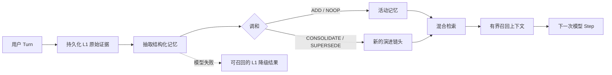

# @evyn/dsh-memory

> 为 [DeepSeek Harness](https://github.com/deepseek-ai/deepseek-harness) 提供持久、可审计的跨会话记忆。

[English](README.md) | 简体中文

`@evyn/dsh-memory` 是一个原生 DeepSeek Harness 插件，让智能体能够跨 Session 保留长期记忆。它会提取值得长期保存的用户事实与身份信息，保留原始证据，在不破坏历史的前提下调和重复或变化的信息，并在模型回答前召回相关上下文。

本插件直接构建于 Harness 原生的生命周期、LLM、Session 与存储能力之上。包内同时提供可信的 `ctx.memory` 服务，以及一组权限边界更窄的模型侧记忆工具。

> [!IMPORTANT]
> 本项目目前处于 `0.1.x` 阶段。存储格式与公共 API 已有测试覆盖并可使用，但在稳定版本发布前仍可能调整。

## 特性

- **跨会话记忆**——记忆归属于租户、用户和智能体，而不是单个 Session。
- **原始证据优先持久化**——在可能失败的模型抽取开始前，先提交来源内容。
- **结构化记忆分层**——支持基础画像、原始证据、事实、摘要和稳定身份信息。
- **非破坏式演进**——重复、合并或被取代的事实都会保留来源与版本关系。
- **可替换的混合检索**——将便携哈希空间或训练型 Embedding Provider 与可配置的中文感知 BM25、倒数排名融合组合。
- **自动捕获与召回**——接入 Harness Turn 事件，同时保留原有 Session 日志。
- **显式模型工具**——提供新增、搜索、列出和遗忘操作，作用域由服务端派生。
- **优雅降级**——抽取失败时，原始 L1 记录仍然持久且可召回。
- **数据可迁移**——可信消费者可导入、导出经过校验并带嵌入空间标识的记录。

## 工作原理



每次写入都会先持久化一条 L1 原始记录和一个持久作业。使用抽取模式时，记忆模型会收到完整的输出 JSON Schema，并生成经过校验的 JSON；未知可选字段应省略，不得以 null 或占位值填充。每条抽取事实或身份信息都有独立的同层、同所有者候选 shortlist；没有候选的来源会确定性生成 `ADD`，无需调和调用。增强成功后会生成结构化记录，并把原始内容保留为来源证据；增强失败则返回 `degraded` 回执，同时保持原始内容可召回。

搜索会在排序前按所有者、可见性、状态、有效期、记忆层和可选的 Session 范围过滤。画像记忆与普通记忆使用相互独立的结果配额。

## 环境要求

- 已配置可用对话模型的 DeepSeek Harness `0.1.5-rc.2`（当前 peer 依赖与测试目标）
- Node.js `^22.19.0` 或 `>=24.0.0`
- Harness 持久存储；Web profile 已默认提供
- 从源码开发时使用 pnpm `11.7.0`

## 快速开始

### 安装插件

将已发布或已打包的版本安装到 Harness Web profile：

```sh
dsh plugin --profile web add @evyn/dsh-memory
dsh --profile web --dump-config
dsh --profile web
```

包内 patch 会同时挂载记忆服务、工具和可选的 Web 管理消费者，每次抽取写入都跟随 Web profile 的当前默认模型，包括启动后在设置页修改的选择。

也可以直接从指定 Git 版本安装：

```sh
dsh plugin --profile web add github:<owner>/dsh-memory#<commit-sha>
```

Git 安装会运行包的 `prepare` 脚本。如果 `dsh` 提示 pnpm 构建授权，请按提示完成一次性授权。

### 使用本机 Harness 与 DashScope

本次集成目标为 `0.1.5-rc.2`；旧版 `0.1.0-rc.7` 的 `llm-pi-ai` 不支持本示例需要的 `supportsDeveloperRole` 配置。升级已有源码后建议先在 Harness 仓库运行 `pnpm install --frozen-lockfile`、`pnpm clean`、`pnpm build`，再安装插件。

在本仓库中执行，假设旁边已有构建完成的 Harness `0.1.5-rc.2` 源码：

```sh
pnpm install
pnpm build
export DSH_HARNESS_DIR=/home/cyw/deepseek-harness
export DSH_HOME="$PWD/.local/harness-home"
node "$DSH_HARNESS_DIR/apps/cli/lib/bin.js" plugin --profile web add "$PWD"
node "$DSH_HARNESS_DIR/apps/cli/lib/bin.js" --profile web --patch "$PWD/examples/dashscope.patch.yml" --port 3080
```

使用 Harness 启动时输出的带认证信息的链接打开页面（这里使用端口 `3080`）。尚未登录时直接访问根地址可能返回 HTTP 401，先打开启动链接即可建立浏览器会话。目录安装会链接已构建的包；源码修改后需要重新构建并重启。`.local/` 保存这套部署的设置、会话和记忆，重启时应沿用相同的 `DSH_HOME`。若需要固定的安装产物，可先运行 `pnpm pack --out /tmp/dsh-memory.tgz`，再把压缩包路径传给 `plugin ... add`。

[DashScope overlay](examples/dashscope.patch.yml) 从启动环境读取 `DASHSCOPE_API_KEY` 和 `DASHSCOPE_API_URL`，使用 `qwen3.7-flash` 进行对话与记忆抽取。URL 应为 OpenAI 兼容接口的 base URL，不含 `/chat/completions`。它使用 Harness 的 `llm-pi-ai` 适配器，Embedding 仍在本地执行。示例中的 token 限制是部署上限，不是模型厂商的最大规格。已有保存的默认模型设置优先于 overlay；复用旧 home 时，可在设置页选择 `dashscope-memory / qwen3.7-flash`。密钥不会写入 overlay 文件。

覆盖已安装 bundle 时，应通过 `--patch` 传入以 `id: memory` 为目标、包含 `config: { provider: ..., model: ... }` 的 patch，不要把带 `name` 的 Loader 根配置条目当作 patch。

### 验证完整联动

```sh
pnpm harness:smoke --harness /home/cyw/deepseek-harness
# 显式调用 DashScope，使用上述两个环境变量：
pnpm harness:smoke --harness /home/cyw/deepseek-harness --live
```

脚本构建并打包插件，通过真实 CLI 安装到临时 home，再先后启动两个独立 Harness 进程。检查内容包括工具注册与搜索、自动抽取、原始证据落盘、冷重启后的跨会话召回和 Web HTTP 200。默认模式仅模拟 LLM；安装依赖时可能联网下载包。live 模式从空工作目录发送合成测试对话。两种模式结束后都会删除临时 home 并停止宿主进程。普通 `pnpm test` 不需要外部模型凭据。

### 手动配置

需要固定抽取模型时，同时提供两个路由字段。下面是 Loader 根配置片段：

```yaml
- name: '@evyn/dsh-memory'
  config:
    provider: deepseek
    model: deepseek-chat
    autoCapture: true
    autoRecall: true

- name: '@evyn/dsh-memory/tool'
```

对于 headless 或自定义 profile，需要先挂载以下依赖：

- `dsh-agent`
- `dsh-llm`
- `dsh-storage`
- 一个存储后端
- `dsh-storage-domain`

启用后只需正常对话：已完成的用户 Turn 可被自动捕获，后续回答前会自动注入相关记忆；智能体也可以调用下文列出的显式工具。

## 配置

### 核心选项

| 选项 | 类型 | 默认值 | 说明 |
| --- | --- | --- | --- |
| `provider` | `string` | 当前默认模型 | 固定抽取 provider；与 `model` 同时提供，或同时省略。 |
| `model` | `string` | 当前默认模型 | 固定抽取模型；与 `provider` 同时提供，或同时省略。 |
| `userId` | `string` | Harness 匿名 ID | 用于确定记忆所有权的稳定用户身份。 |
| `tenantId` | `string` | 未设置 | 可选的租户命名空间。 |
| `autoCapture` | `boolean` | `true` | 直接用户 Turn 停止时抽取持久记忆。 |
| `autoRecall` | `boolean` | `true` | 包含直接用户输入的 Step 开始前召回记忆。 |
| `embedding` | 对象 | `{ kind: "hash" }` | 便携哈希或 OpenAI 兼容 Embedding 配置。 |
| `tokenizer` | 对象 | `{ kind: "cjk-bigram" }` | CJK bigram 或 legacy BM25 分词策略。 |

同时省略两个字段时，服务会在原始证据持久化后读取 `agentDefaultModel.currentSelection()`。同一次写入的抽取与调和使用同一 provider/model，后续写入读取新的设置。显式指定的模型对保持固定；缺少其中一个或提供空白值均无效。没有默认模型服务时，直接写入和读取仍然可用，抽取返回 `degraded` 回执并保留可召回原文。bundle 声明了对 `agentDefaultModel` 的依赖。

### Embedding Provider

默认 `HashEmbeddingProvider` 确定、离线，并保持既有 `dsh-memory/hash-token-char-v1/256/l2` 空间。Loader 部署可以显式启用训练型 OpenAI 兼容端点：

```yaml
- name: '@evyn/dsh-memory'
  config:
    provider: deepseek
    model: deepseek-chat
    embedding:
      kind: openai-compatible
      baseUrl: https://example.invalid/compatible-mode/v1
      apiKeyEnv: MEMORY_EMBEDDING_API_KEY
      model: multilingual-embedding-model
      spaceId: deployment/multilingual-embedding-model/1024/l2
      dimensions: 1024
      batchSize: 128
      timeoutMs: 30000
      maxRetries: 2
      retryBaseDelayMs: 100
```

`apiKeyEnv` 只指定环境变量名；字面量密钥会被拒绝，解析后的公开配置也不会包含密钥值。程序化消费者可以改为传入实现 `EmbeddingProvider` 的 `embeddingProvider`；程序化入口与 Loader 配置入口互斥。

核心按 provider 声明的上限顺序分批，保持输入输出顺序，校验数量、维度、有限非零数值，并执行最终 L2 归一化。参考远端适配器只在网络故障、HTTP 408/429/5xx 和单次超时时按配置上限重试；调用方取消会保持原始原因向上传递。

### 词法分词

默认 `CjkBigramTokenizer` 会把每段 ASCII 字母数字转为小写 token，并把每段连续 Basic Han 字符（`U+3400`–`U+9FFF`）拆成重叠 bigram；单个汉字保留为单字符 token。标点、空白、下划线、emoji、全角拉丁字符和 supplementary Han 都是分隔符。实现刻意不做 Unicode 归一化、词干提取、停用词、词典或同义词扩展。

配置 `tokenizer: { kind: "legacy" }` 可把 BM25 回滚到 MEM-102 之前的整段中文 token 行为。该回滚不会改写任何持久向量、embedding space、canonical 记录或演进关系。带版本的便携哈希实现始终走私有 legacy token 路径，因此两种词法模式都不会改变 `dsh-memory/hash-token-char-v1/256/l2` 的任何向量元素。

受信任的程序化消费者也可以注入实现 `LexicalTokenizer` 的 `lexicalTokenizer`；它与 Loader 的 `tokenizer` 配置互斥。构造时会用空字符串做脱敏 preflight。运行时输出必须是实际数组，最多包含 100,000 个非空字符串，每个 token 最多 256 个 UTF-16 code unit，并会立即复制。故障只暴露 `TOKENIZATION_FAILED` / `lexical tokenizer failed`。自定义 tokenizer 在进程内同步执行；若实现进入无限循环，调用边界无法抢占，因此宿主必须只注入可信且资源有界的实现。

### 限制与检索策略

| 选项 | 默认值 | 说明 |
| --- | ---: | --- |
| `maxModelTokens` | `4096` | 每次抽取或调和调用的最大输出 token 数。 |
| `maxInputChars` | `50000` | 单次写入的最大来源字符数，或单次搜索的最大 query 字符数。 |
| `maxRecordChars` | `4000` | 单条派生记录保留的最大字符数。 |
| `recallLimit` | `8` | 普通召回通道的最大结果数。 |
| `profileLimit` | `4` | 单独预留的画像结果数。 |
| `maxContextChars` | `6000` | 单个模型 Step 注入记忆上下文的最大字符数。 |
| `reconcileCandidateLimit` | `12` | 每条 extracted memory 提供给调和流程的现有候选上限。 |
| `minSemanticScore` | `0.08` | 无词法匹配时所需的最低哈希向量余弦分数。 |
| `rrfK` | `60` | 倒数排名融合的平滑常数。 |
| `bm25K1` | `1.5` | BM25 词频饱和参数。 |
| `bm25B` | `0.75` | BM25 文档长度归一化参数。 |
| `profileFields` | name、age、location、timezone、language、occupation | 抽取器可更新的 L0 画像字段。 |

## 记忆分层

| 层级 | 用途 | 当前 provider 是否写入 |
| --- | --- | --- |
| `l0_basic_info` | 结构化基础画像 | 是 |
| `l1_raw` | 原始来源证据 | 是，在增强前写入 |
| `l2_fact` | 事件与变化中的事实 | 是 |
| `l3_summary` | 模型生成的摘要 | 是 |
| `l4_identity` | 稳定偏好、特征与身份 | 是 |
| `l5_knowledge` | 预留的便携层 | 否 |
| `l6_schema` | 预留的便携层 | 否 |
| `l7_intention` | 预留的便携层 | 否 |

L5-L7 保留在公共类型中以兼容数据格式，但当前参考 provider 会拒绝写入或导入这些层。

## 模型侧工具

安装 bundle 后还会挂载 `@evyn/dsh-memory/tool`：

| 工具 | 用途 |
| --- | --- |
| `memory_add` | 保存一条用户明确表达的事实或稳定身份信息。 |
| `memory_search` | 搜索相关的跨会话记忆，可选择返回演进历史。 |
| `memory_list` | 检查最近记忆，可按记忆层或 Session 过滤。 |
| `memory_forget` | 用户明确要求后，按准确 ID 软删除一条记忆。 |

所有作用域 ID 都从当前所属 Agent 派生，模型无法自行选择租户、用户、智能体或 Session ID。批量导入和导出仅通过可信服务 API 提供。

## 服务 API

包根入口会挂载 `ctx.memory` 并实现 `MemoryCapability`：

```ts
const scope = ctx.memory.scopeFor(agent)

const receipt = await ctx.memory.add({
  scope,
  content: '用户偏好使用 TypeScript 开发后端服务。',
  layer: 'l4_identity',
  tags: ['typescript', 'backend'],
  idempotencyKey: 'preference-typescript',
})

const result = await ctx.memory.search({
  scope,
  query: '用户开发后端时偏好什么语言？',
  includeEvolution: true,
})
```

完整能力包括：

- `scopeFor(agent)`
- `add(input, signal?)`
- `search(input, signal?)`
- `get(memoryId, scope)`
- `list(input)`
- `forget(memoryId, scope, expectedRevision?)`
- `managementScopes()` / `inspect(scope)`
- `revise(input, signal?)`
- `export(scope)` / `import(scope, records)`
- `health()`

公共 TypeScript 类型从 `@evyn/dsh-memory` 和 `@evyn/dsh-memory/types` 导出。

## 身份、隐私与模型行为

记忆以 `{tenantId, userId, agentId}` 作为所有者键。当前 `sessionId` 仅作为来源信息和可选读取过滤条件，因此智能体可以召回较早 Session 的记录，同时不会混淆不同所有者。

启用自动召回后，插件会在当前用户消息前插入一条有长度上限、由 `<memory-recall>` 明确分隔的 user 消息。它会把召回记录标记为可能有误的背景，并要求模型在发生冲突时以当前请求为准。召回消息通过普通 Session surface 写入，因此可以从日志重建模型实际看到的请求。

启用自动捕获后，已完成用户 Turn 中的非工具对话会作为不可信 JSON 数据发送给配置的记忆模型。抽取不会改变已经在生成中的回答。每个 Turn 会增加一次抽取调用和至多一次调和调用；若所有抽取来源的 shortlist 都为空，则通过确定性 `ADD` 省去第二次调用。

使用远端 embedding 空间时，新增操作仍会在任何网络 I/O 前提交可召回的 L1 原始记录与 `accepted` 作业。首次提交使用同空间、同维度的零向量占位；增强成功后替换为已校验向量。Provider 失败会把作业标为 `degraded`、不创建派生记录，并保留可通过词法通道召回的原文。搜索只有在按 owner、状态、可见性、有效期、层级和 Session 完成过滤后才调用 provider 与 tokenizer；候选为空时两者都不会调用。非取消类 provider 故障只关闭语义排序并报告 `semantic:provider-unavailable`；tokenizer 故障只关闭 BM25 并报告 `lexical:tokenizer-unavailable`；两者均不可用时返回空通道和两项诊断。调和会先按来源层级过滤 active、recallable 且当前有效的记录，不以 Session 作为边界；只有候选池非空的来源才进入 provider/tokenizer。来源 query 按顺序有界分批嵌入；某批失败只关闭该批来源的语义通道，后续批次继续。每个来源可只依赖词法，或在 query 向量及至少一条候选向量均非零时只依赖语义；任一非空候选来源同时失去两条通道时，整个 accepted job 会用固定脱敏 tokenizer 错误降级，不提交部分派生记录。模型只看到 shortlist 非空的来源、稳定去重的候选目录和逐来源授权 ID。调用方取消绝不会被转换为降级成功。

记忆内容会被发送到所配置的 embedding 端点。部署者应根据内容敏感程度选择端点及保留策略。密钥只从命名环境变量读取，不会进入 descriptor、错误、日志或评测报告。

默认匿名用户 ID 只是本地关联身份，不代表认证或授权。处理敏感或敌意内容的部署应提供经过认证的 `userId`，审查数据保留策略，并按自身威胁模型增加内容策略过滤。

## 记忆管理与诊断

安装 bundle 并重启 Harness 后，在 **设置 → 记忆** 中查看当前本机所有者的跨会话记忆。可切换已存在的智能体预设，按内容/标签、层级和状态筛选，分页查看来源证据及版本历史。默认只显示有效记录；软删除的记录可通过状态筛选查看。

- **确认记忆**：为当前事实或身份/偏好保存人工确认的原始证据及新版本。
- **更正**：保存新内容，并建立与旧版本的双向替代关系。只允许修改当前有效且可召回的 L2/L4，不能直接改写原始证据。
- **软删除**：确认后停止召回；删除来源证据可能使失去全部来源的派生记录一起软删除。它不擦除磁盘历史。
- **状态与诊断**：展示可召回/全部记录计数、完成/降级写入、捕获/召回开关及检索类型。最近 30 个持久作业显示耗时、逻辑模型调用次数和安全错误码；旧作业没有的诊断字段显示为空。最近 20 次自动召回仅列出实际注入的记忆，来自最多 200 条全局进程内缓存，重启后清空。

处理中作业不显示未完成的调用计数；中断恢复作业保留开始时间和恢复时间，但耗时与调用次数显示为未知，避免把停机时间误算为处理耗时。

页面不会自动轮询；点击“刷新”获取最新状态，操作成功后自动刷新。操作使用整个 owner scope 的修订号校验，若其他会话已写入，会要求刷新后重试。确认/更正不调用抽取模型，但配置外部 embedding 时仍会发送新证据与新版本内容到该服务；嵌入失败会保留旧记忆，并把已保存的原始证据标为降级、保持可召回。

管理端通过 Harness Connection 的登录 cookie、Host 与 Origin 校验保护 `/api/memory-management/*` RPC。浏览器只能选择服务端列出的预设，不能指定 tenant/user/session；响应不包含向量、任意 metadata、原始作业警告或提供方错误正文。记忆正文及来源证据会显示给已登录的本机管理者。此入口沿用本机部署所有者权限，不提供多人认证主体映射。

可信服务新增 `managementScopes()`、`inspect(scope)`、`revise({scope, memoryId, expectedRevision, action, content?, idempotencyKey})`；`forget(memoryId, scope, expectedRevision?)` 可选校验作用域修订号。这些接口不新增模型工具。`/management` 宿主入口仅在 `memory`、`connection`、`webServer` 都就绪时挂载；无 Web 服务的组合仍能使用记忆服务和原有工具。

实际浏览器验收使用独立临时 `DSH_HOME`，不访问外部模型，测试打包安装、认证、隔离、页面操作与冷重启：

```sh
# 在 Harness 源码中安装 Playwright Chromium（需系统浏览器运行库）
node "$DSH_HARNESS_DIR/apps/web/node_modules/playwright/cli.js" install chromium
pnpm harness:management-smoke --harness "$DSH_HARNESS_DIR"
```

## 当前限制

- 内建哈希嵌入可移植且确定，但弱于经过训练的多语言嵌入模型。
- 一个非空存储只能使用活动的 embedding `spaceId` 与维度。切换 provider、模型、维度或归一化方式必须使用新 `spaceId`；MEM-101 会拒绝冷切换和异空间导入，不执行重嵌入，迁移留给 MEM-104。
- 标签会参与词法文本检索，但目前没有独立标签索引。
- 受信任的自定义 tokenizer 是进程内同步扩展；其输出有边界，但永不返回的实现无法在调用边界被中断。
- 每次变更都会原子替换一个所有者的整行 JSON 状态，不适合超大规模语料。
- 按所有者串行化仅限单进程；storage domain 尚不提供跨进程 compare-and-set。
- 抽取与调和要求模型返回严格 JSON；说明文字或错误格式会导致封闭失败。
- 自动捕获会为每个完成的用户 Turn 最多增加两次模型调用。
- 项目尚未内建认证主体映射、数据保留策略和可写的 L5-L7 语义。

架构、行为保证与未采用的替代方案详见[设计文档](docs/design.zh.md)。

## 规划中的能力

“隐私感知的自适应记忆”目前处于 Draft 设计阶段，尚未改变当前版本的默认行为。规划包含本地隐私防火墙、敏感 query 的远端出口控制、可解释的自适应捕获、效用账本、确定性重排、token-aware 上下文装箱，以及按顺序质量门发布的评测与回滚策略。详见[开发计划](docs/privacy-aware-adaptive-memory-plan.zh.md)。

## 本地开发

```sh
git clone <repository-url>
cd dsh-memory
pnpm install
pnpm typecheck
pnpm test
pnpm build
pnpm run eval:embedding
pnpm run eval:lexical
```

离线 Embedding 评测会先构建产物，再使用临时 JSON 存储以及公共 `import()`/`search()` API，全程不访问网络。Live 质量评测具有显式双重授权，并从 `DASHSCOPE_API_URL` 与 `DASHSCOPE_API_KEY` 读取端点和密钥：

```sh
pnpm run eval:embedding:live
```

该 DashScope 脚本固定批量大小为 16、`repeat` 为 1，用于一次有界观测运行。不要在未明确授权网络访问时把 live 命令用于普通测试或 CI。报告会包含 provider、模型、空间、维度及聚合/逐例指标，但不会包含端点、密钥、请求头、响应体、向量或临时路径。

词法评测也会先构建包，并在全新临时 Context 中对同一份冻结的 258 条记录语料运行两次：先用 `legacy`，再用 `cjk-bigram`。报告包含逐例排名、Recall@5/10、MRR@10、分桶指标、delta 与隔离 hard checks，且不访问网络。Embedding 评测会显式选择 `legacy`，使 MEM-101 baseline 不受新的默认词法策略影响。

测试覆盖原始证据优先的幂等写入、跨会话检索、自动召回、抽取降级、记忆调和、证据感知遗忘、四个模型工具，以及 Loader 冷重启后的持久化。

## 参与贡献

欢迎提交 Issue 和 Pull Request。行为变更请同时补充测试；面向用户的文档发生变化时，请同步更新 `README.md` 与 `README.zh.md`。提交 PR 前请运行 `pnpm typecheck`、`pnpm test` 和 `pnpm build`。

## 许可证

本项目基于 [MIT License](LICENSE) 开源。
