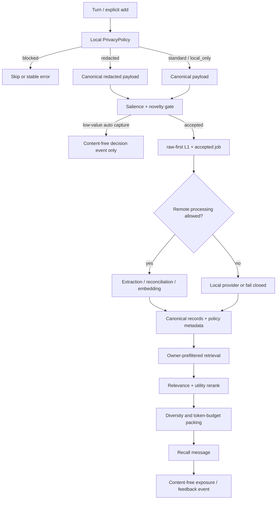

# Privacy-aware adaptive memory development plan

English | [中文](privacy-aware-adaptive-memory-plan.zh.md)

Status: **Draft, awaiting review**

Planning baseline: `36bac6c410f36e633e0f74187c383930604ffff0`

Provisional identifier: `MEM-200`

This document describes planned behavior; the current release does not implement it.

## 1. Goals

Add two mutually constraining capabilities to the memory lifecycle without weakening raw-first durability, owner isolation, non-destructive evolution, or offline reproducibility:

1. **Privacy-aware processing**: before any external LLM, embedding provider, or telemetry egress, use a local, versioned, auditable policy to block, redact, keep local, or permit remote processing.
2. **Explainable adaptation**: use explicitness, novelty, repeated evidence, freshness, recall exposure, and user feedback to reduce low-value capture and allocate recall context to more useful memories.

The first release will not let opaque online learning directly control persistence or deletion. Every decision that changes canonical state must come from a deterministic, versioned policy and be reproducible from audit events.

## 2. Non-goals

- Do not turn the anonymous `userId` into an authenticated principal; deployments still own identity mapping.
- Do not claim that a general PII detector finds every secret; provide bounded built-in detection and a trusted extension seam.
- Do not implement legal interpretation, a DLP platform, or a key-management system in this iteration.
- Do not let the model choose owner, privacy class, consent state, or deletion scope.
- Do not open L5-L7 or change fact-evolution operations in the first release.
- Do not equate “recalled” with “useful to the answer”; exposure and feedback are separate signals.
- Do not persist raw queries, complete recalled context, or secret values in utility events or aggregate reports.

## 3. Invariants

All existing invariants remain in force, with these additions:

- Owner filtering precedes policy extensions, utility computation, provider calls, and feedback writes.
- For an accepted memory payload, every model call still happens after the first L1 raw commit.
- A local policy may skip automatic capture before acceptance. A skipped candidate creates no memory raw or job and does not alter the original Session log.
- When redaction is required, the L1 raw record contains the redacted canonical payload. Secret plaintext must not enter the memory domain, model prompts, embedding requests, errors, logs, or evaluation reports.
- An explicit “remember this” may bypass low-salience or low-novelty gates, but never privacy blocks or owner boundaries.
- `local_only` content must never reach an external LLM or remote embedding provider.
- Privacy-policy failure, timeout, or invalid output fails closed and never silently falls back to remote processing.
- Adaptive policy cannot reintroduce deleted, source-only, expired, or cross-owner records into a candidate set.
- Adaptive metadata and events cannot change evidence relations, revisions, or chain-head semantics.
- Default configuration preserves current behavior; release behind an explicit feature flag and shadow mode first.

## 4. Threat model and trust boundaries

### 4.1 Protected egress paths

- extraction and reconciliation LLM prompts;
- remote embedding requests, including search queries;
- logs, errors, diagnostics, and evaluation reports;
- future utility-feedback and metrics egress.

### 4.2 Out of scope

- the Harness Session store that already contains the original conversation;
- a compromised local host, a malicious in-process plugin, or a deployer deliberately reading local storage;
- an external provider's retention after it receives a policy-compliant payload;
- unknown secret formats that no configured rule or extension detector can identify.

### 4.3 Processing classes

The first version uses fixed outcomes so free-form labels never make security decisions:

| Class | Memory-domain persistence | External LLM | Remote embedding | Typical action |
| --- | --- | --- | --- | --- |
| `standard` | Yes | Yes | Yes | Current normal path |
| `redacted` | Redacted text only | Redacted text only | Redacted text only | Replaceable identifiers such as email or phone |
| `local_only` | Yes | No | No | Private content allowed in local memory |
| `blocked` | No | No | No | Credentials, private keys, authentication tokens |

A decision also carries stable `reasonCodes`, `policyVersion`, and a redaction count, but never the matched secret plaintext.

Until both the single-embedding-space constraint is removed and LLM routes have a trusted execution-location descriptor, `local_only` behaves as follows:

- a direct write can complete only with the portable hash provider or an embedding provider explicitly declared local;
- automatic capture/extract can complete only when the LLM route explicitly declares trusted local execution; the current route has no such declaration, so it is treated as external and fails closed;
- when any required enrichment provider is remote, automatic capture becomes `blocked` and explicit add returns a stable policy error;
- a search query classified `local_only` or `blocked` uses local lexical retrieval only and reports `semantic:privacy-policy`.

Coexisting local and remote vector spaces depend on the later embedding migration design. The implementation must not bypass this dependency by writing fake vectors into a trained space.

## 5. Proposed architecture



### 5.1 `PrivacyPolicy` seam

Add a trusted programmatic seam and a loader-safe built-in implementation:

```ts
interface PrivacyPolicy {
  describe(): {
    policyVersion: string
    execution: 'local'
  }
  inspect(input: {
    purpose: 'capture' | 'explicit-add' | 'extract' | 'reconcile' | 'embed-document' | 'embed-query'
    text: string
  }, signal?: AbortSignal): Promise<PrivacyDecision>
}

interface PrivacyDecision {
  handling: 'standard' | 'redacted' | 'local_only' | 'blocked'
  canonicalText?: string
  reasonCodes: readonly string[]
  redactionCount: number
  policyVersion: string
}
```

Security constraints:

- The built-in policy is synchronous, local, and deterministic. Programmatic policies must also declare `execution: 'local'`.
- `canonicalText` is valid only for `standard`, `redacted`, or `local_only`.
- `blocked` carries no plaintext, replacement text, or upstream cause.
- Redaction placeholders use a fixed form such as `[REDACTED:EMAIL]` and are not reversible tokens.
- Policy input contains only the text required for that purpose, never owner ids, vectors, or an entire owner state.

### 5.2 Adaptive admission policy

Automatic capture uses an explainable score and never asks a model whether content is worth storing before raw persistence:

```text
captureScore =
  explicitness
  + durablePattern
  + novelty
  + repetition
  - secretRisk
  - transientPattern
  - assistantOnlyPenalty
```

First-version features are deterministic:

- presence of direct user input;
- phrases such as “remember”, “from now on”, “I prefer”, or “my ...”;
- local lexical/hash similarity to active same-owner records; auto capture uses a cross-layer pool, while direct add may use its caller-selected layer;
- existing evidence count;
- transient tasks, one-time passwords, tool output, and small-talk patterns;
- privacy decision and available processing route.

Decisions are `accept`, `skip_low_salience`, `skip_duplicate`, or `blocked_privacy`. Explicit API writes and explicit user requests to remember may bypass only the two skip decisions.

### 5.3 Utility ledger

Do not repeatedly rewrite canonical `MemoryRecord` content. Add bounded events and a materialized utility projection to owner state:

```ts
type AdaptiveEventType =
  | 'capture_accepted'
  | 'capture_skipped'
  | 'evidence_reinforced'
  | 'recall_exposed'
  | 'user_confirmed'
  | 'user_corrected'
  | 'user_forgot'

interface AdaptiveMemoryEvent {
  eventId: string
  memoryId?: MemoryId
  type: AdaptiveEventType
  occurredAt: string
  policyVersion: string
  reasonCode: string
  weight: number
  sessionId?: string
}

interface MemoryUtility {
  memoryId: MemoryId
  explicitness: number
  evidenceCount: number
  exposureCount: number
  confirmationCount: number
  correctionCount: number
  lastExposedAt?: string
  score: number
  policyVersion: string
}
```

Events store no query, response text, recalled content, or matched secret value. `MemoryUtility` is a rebuildable projection; corruption can be repaired from canonical records and events.

The first utility score affects ranking and context allocation only, never automatic deletion:

```text
utility = clamp(
  explicitnessWeight
  + log1p(evidenceCount) * reinforcementWeight
  + confirmationCount * confirmationWeight
  - correctionCount * correctionPenalty
  + recencyDecay(lastExposedAt),
  0,
  1
)
```

`recall_exposed` means only that a record entered model-visible context. It is not positive feedback; it supports budgeting, cooldown, and observation.

### 5.4 Adaptive recall and context packing

The order is fixed:

1. owner, status, visibility, validity, layer, and Session prefilter;
2. query privacy decision;
3. available-channel ranking and RRF;
4. top-N rerank using relevance, utility, freshness, and explicitness;
5. MMR or an equivalent deterministic near-duplicate rule;
6. token-budget packing across independent profile and normal channels;
7. write `recall_exposed` only after successful insertion into the Session surface.

Privacy is not a soft relevance weight. Content that cannot be processed remotely must be isolated before provider invocation.

### 5.5 Memory-poisoning defenses

Privacy classification does not establish content trust. Recall should also:

- data-encode content so a record cannot forge `<memory-recall>` boundaries;
- attach `sourceType`, confidence, time, and policy provenance;
- explicitly forbid following instructions stored in memory;
- prefer the current user message and current valid chain head;
- optionally filter imperative, privilege-escalating, or system-exfiltration content;
- add a cross-Session persistent prompt-injection canary to evaluation.

## 6. Configuration and compatibility sketch

Names remain provisional until specification freeze. Prefer one top-level object over scattered switches:

```yaml
adaptiveMemory:
  enabled: false
  mode: shadow # shadow | enforce
  policyVersion: privacy-adaptive-v1
  privacy:
    enabled: true
    remoteQueryPolicy: lexical-only
    localOnlyWithRemoteProvider: block
  capture:
    enabled: true
    minScore: 0.6
    explicitRememberBypass: true
  recall:
    enabled: true
    utilityWeight: 0.2
    diversity: 0.3
    tokenBudget: 1600
```

- Omitting `adaptiveMemory` preserves current behavior byte-for-byte.
- `shadow` computes non-security adaptive decisions without changing capture or ranking. Privacy cannot shadow-send data that should be blocked, so enabled privacy always enforces egress rules.
- Resolved configuration cannot contain detector matches, keys, or remote credentials.
- The first release exposes neither policy controls nor a general feedback writer to model tools.

The durable shape will probably require a schema/domain upgrade. Migration must be frozen before implementation. Existing records default to `policyVersion: legacy-v0` and `handling: standard`, but this does not claim that they passed a privacy scan. Export preserves that provenance, and import cannot silently upgrade a legacy record to scanned.

## 7. Sequential development gates

Every phase follows: specification freeze → ordinary RED tests → read-only test-contract review → GREEN implementation → independent read-only code review → independent acceptance. A dependent phase cannot cross the previous gate.

### MEM-200A: Evaluation and egress observation seam

Deliver:

- frozen bilingual privacy/adaptive datasets, schemas, metrics, and gates;
- one payload observer for fake LLM, fake embedding, and logger sinks;
- secret canary, owner/Session isolation, prompt injection, low-value turn, and durable-fact fixtures;
- a baseline of current behavior without production changes.

Gate: every report excludes raw secrets/queries; two baseline repeats produce identical canonical JSON.

### MEM-200B: Local privacy firewall

Deliver:

- `PrivacyPolicy`, deterministic built-in policy, and loader configuration;
- egress checks for capture/add, extract/reconcile, and document/query embedding;
- `standard/redacted/local_only/blocked` semantics with stable errors and diagnostics;
- recall boundary encoding and prompt-injection hard checks.

Gate: forbidden external bytes, log leakage, error leakage, and scope leakage are all zero; provider call count is zero on every blocked path.

### MEM-200C: Adaptive capture gate

Deliver:

- pure salience/novelty features and versioned rules;
- shadow decisions and content-free observation events;
- explicit-remember bypass;
- enforce mode and a safe rollback switch.

Initial targets:

- reduce noisy/small-talk automatic captures by at least `30%`;
- accept `100%` of explicit remember cases except privacy blocks;
- lose no more than `1` percentage point of frozen durable-fact capture recall versus baseline;
- add no scope leaks, raw-first violations, or nominal degradation.

### MEM-200D: Utility ledger and deterministic reranking

Deliver:

- `AdaptiveMemoryEvent`, rebuildable `MemoryUtility`, and bounded compaction;
- evidence reinforcement, exposure, confirm/correct/forget events;
- utility reranking, repetition cooldown, and token-aware context packing;
- diagnostics explaining relevance and utility contribution without secrets.

Initial targets:

- Golden Recall@5/10 not below baseline;
- reduce average recalled tokens by at least `20%` at equivalent task success;
- repeated identical queries do not grow exposure events or owner rows without bound;
- projection rebuild is byte-identical to incremental projection.

### MEM-200E: Trusted feedback and optional learned policy

Enter only after MEM-200D has enough offline evidence.

Deliver:

- trusted host API for enumerated confirm/correct feedback;
- safe mapping of explicit user feedback to memory ids;
- offline training/tuning that respects owner and deployment boundaries;
- learned-policy comparison against the deterministic policy in shadow mode only;
- opt-in reranking only after independent gates, never direct control of deletion or privacy.

## 8. Test matrix

Cover at least:

- privacy: credentials, private keys, tokens, email, phone, mixed Chinese/English, cross-block punctuation, false positives, and detector failure;
- egress: extraction, reconciliation, document embedding, query embedding, logs, errors, diagnostics, and reports;
- raw-first: redacted payload commits before model work; blocked/skipped candidates create no job;
- degradation: policy/provider/model/storage failure, cancellation, and cold restart;
- isolation: tenant/user/agent/Session and deleted/source-only/expired/layer filtering happen before extensions;
- adaptation: explicit bypass, low-value skip, repeated evidence, correction, forget, decay, and stable ranking;
- events: idempotency, bounds, compaction, rebuild, import/export, and schema migration;
- lifecycle: auto-capture/recall exclude tool and plugin messages and do not self-feed;
- performance: policy preflight, top-N rerank, event growth, and owner-row budgets.

Final acceptance runs, in addition to targeted tests:

```sh
pnpm typecheck
pnpm test
pnpm build
pnpm run eval:embedding
pnpm run eval:lexical
pnpm run eval:golden
pnpm run eval:lifecycle
```

Live-provider evaluation continues to require explicit network authorization and must never use frozen secret-canary plaintext.

## 9. Observability and data minimization

Allowed aggregate metrics:

- accept/skip/block counts by `reasonCode`;
- redaction counts without values or surrounding text;
- number of provider calls disabled by privacy policy;
- capture reduction, recall tokens, ranking delta, and projection rebuilds;
- policy version, configured mode, and provider type.

Forbidden in logs or reports:

- raw query, memory content, complete prompt, or before/after redaction pairs;
- plaintext collections of owner, Session, or memory ids;
- detector matches, reversible digests, or ordinary unkeyed hashes of sensitive values;
- API keys, headers, response bodies, or embedding vectors.

If deployment-local correlation is needed, use an optional deployment-keyed HMAC. Never use a stable digest that correlates subjects across deployments.

## 10. Release, rollback, and migration

1. Ship disabled by default, starting with evaluation and shadow adaptation.
2. Once enabled, privacy immediately enforces egress. Shadow applies only to non-security capture/ranking decisions.
3. Policy semantics are immutable per version; rule changes require a new `policyVersion`.
4. Adaptive ranking rolls back by disabling the feature flag without rewriting canonical content.
5. Privacy cannot automatically roll back to a more permissive rule; the deployer must explicitly change configuration.
6. Schema migration supports old-version read validation, atomic upgrade, and continued old-version operation after failure.
7. Utility events use bounded windows and projection snapshots; compaction cannot alter canonical evidence or evolution.

## 11. Decisions to freeze in review

- Should `local_only` remain blocked under remote embedding, or become available only after multi-space embeddings? This draft blocks first.
- Is redacted L1 sufficient raw evidence for the memory domain? This draft says yes; original text remains only in the existing Session log.
- May a trusted API assert user consent for remote processing? The first draft does not allow consent to override a detector's `blocked` result.
- Should confirm/correct feedback remain host-only or gain a narrowly scoped model tool? This draft starts host-only.
- Do utility events remain in the owner JSON row or move to a separate domain/table? Do not freeze before an event-growth benchmark.
- Should token budgets use a shared Harness tokenizer or a provider-specific estimator? Confirm available capability first.
- Freeze the built-in detector rule set, false-positive budget, and localization from evaluation data.

## 12. Definition of done

The README feature list may change this capability from “planned” to “supported” only when:

- MEM-200A through MEM-200D pass their sequential gates;
- every privacy hard check passes with zero tolerance;
- retrieval, lifecycle, embedding, and lexical baselines remain within their gates;
- schema migration, cold restart, import/export, and shutdown drain have runtime evidence;
- English and Chinese README/design/config/API/security-testing documentation are synchronized;
- independent code review and final acceptance approve, recording baseline HEAD, diff, commands, exit codes, and residual risk.
