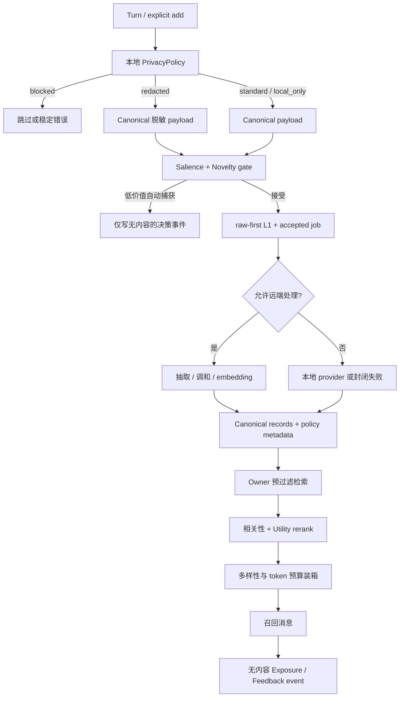

# 隐私感知的自适应记忆开发计划

[English](privacy-aware-adaptive-memory-plan.md) | 中文

状态：**Draft，等待评审**

规划基线：`36bac6c410f36e633e0f74187c383930604ffff0`

临时代号：`MEM-200`

本文描述规划中的能力，不代表当前版本已经实现。

## 1. 目标

在不破坏 raw-first、owner 隔离、非破坏式演进和离线可复现性的前提下，为记忆生命周期增加两个相互约束的能力：

1. **隐私感知处理**：在任何外部 LLM、Embedding Provider 或遥测出口之前，用本地、版本化、可审计的策略决定阻断、脱敏、仅本地处理或允许远端处理。
2. **可解释的自适应**：根据明确性、新颖度、重复确认、时效、召回暴露和用户反馈，减少低价值捕获，并在召回时优先分配上下文预算给更有用的记忆。

第一阶段不使用不透明的在线学习直接控制持久化或删除。所有影响 canonical state 的决策必须由确定性、带版本的策略产生，并能从审计事件复算。

## 2. 非目标

- 不把匿名 `userId` 提升为认证主体；认证映射仍由部署环境负责。
- 不承诺通用 PII 检测器能够识别所有秘密；策略提供有界的内建检测与可信扩展接缝。
- 不在本迭代实现法规判断、DLP 平台或密钥管理系统。
- 不允许模型自行声明 owner、隐私等级、同意状态或删除范围。
- 不在第一阶段开放 L5-L7，也不改变现有事实演进操作。
- 不把“被召回”直接等价为“对回答有用”；暴露与反馈是两类独立信号。
- 不把用户原始 query、完整召回上下文或秘密值写入效用事件及聚合报告。

## 3. 必须保持的不变量

现有不变量继续成立，并增加以下约束：

- owner 过滤必须先于策略扩展、效用计算、provider 调用和反馈写入。
- 对于被接受的记忆 payload，任何模型调用仍发生在 L1 raw 首次提交之后。
- 自动捕获可以在受理前被本地策略跳过；被跳过的候选不创建 memory raw 或 job，原始 Session 日志不受影响。
- 若策略要求脱敏，L1 raw 持久化的是脱敏后的 canonical payload；秘密原文不得进入 memory domain、模型 prompt、embedding 请求、错误、日志或评测报告。
- 显式“请记住”可以绕过低显著性/低新颖度门，但不能绕过隐私阻断和 owner 边界。
- `local_only` 内容不得发送给外部 LLM 或远端 embedding provider。
- 隐私策略失败、超时或返回非法结果时封闭失败；不能静默回退到远端处理。
- 自适应策略不得使 `deleted`、`source_only`、过期或跨 owner 记录重新进入候选集。
- 自适应元数据和事件不得改变证据关系、revision 或 chain head 的含义。
- 默认配置保持当前行为；新能力先以显式 feature flag 和 shadow mode 发布。

## 4. 威胁模型与信任边界

### 4.1 本计划保护的出口

- 抽取和调和 LLM 的 prompt；
- 远端 embedding 请求，包括搜索 query；
- 日志、错误、诊断和评测报告；
- 未来的效用反馈或指标出口。

### 4.2 暂不覆盖

- 已经保存原始对话的 Harness Session 存储；
- 被攻陷的本地主机、进程内恶意插件或部署者主动读取本地存储；
- 外部 provider 在收到合规 payload 后的内部保留策略；
- 无法由配置规则或扩展 detector 识别的未知秘密格式。

### 4.3 数据处理等级

第一版固定以下结果，避免让自由文本标签参与安全决策：

| 处理等级 | 持久化到 memory domain | 外部 LLM | 远端 embedding | 典型处置 |
| --- | --- | --- | --- | --- |
| `standard` | 是 | 是 | 是 | 当前正常路径 |
| `redacted` | 仅脱敏文本 | 仅脱敏文本 | 仅脱敏文本 | 邮箱、电话等可替换标识符 |
| `local_only` | 是 | 否 | 否 | 私密但允许本地记忆的内容 |
| `blocked` | 否 | 否 | 否 | 凭据、私钥、认证 token 等 |

策略输出还必须包含稳定的 `reasonCodes`、`policyVersion` 和脱敏计数，但不得包含命中的秘密原文。

在单 embedding 空间约束解除、LLM 路由具备可信执行位置声明前，`local_only` 的行为如下：

- direct 写入只有在使用便携 hash 或明确声明为本地的 embedding provider 时才能完成；
- 自动捕获/extract 只有在 LLM 路由明确声明为可信本地执行时才能完成；当前路由没有该声明，应默认视为外部出口并封闭阻断；
- 任一必需 enrichment provider 是远端时，自动捕获封闭为 `blocked`，显式写入返回稳定策略错误；
- 搜索 query 被判定为 `local_only` 或 `blocked` 时，只运行本地词法通道，并报告 `semantic:privacy-policy`。

多空间本地/远端并存属于后续 embedding 迁移设计的依赖项，不能通过给训练空间写入伪向量绕过。

## 5. 建议架构



### 5.1 `PrivacyPolicy` 接缝

建议新增可信程序化接缝，并提供 loader-safe 的内建实现：

```ts
interface PrivacyPolicy {
  describe(): {
    policyVersion: string
    execution: 'local'
  }
  inspect(input: {
    purpose: 'capture' | 'explicit-add' | 'extract' | 'reconcile' | 'embed-document' | 'embed-query'
    text: string
  }, signal?: AbortSignal): Promise<PrivacyDecision>
}

interface PrivacyDecision {
  handling: 'standard' | 'redacted' | 'local_only' | 'blocked'
  canonicalText?: string
  reasonCodes: readonly string[]
  redactionCount: number
  policyVersion: string
}
```

安全约束：

- 内建策略同步、本地且确定；程序化策略也必须声明 `execution: 'local'`。
- `canonicalText` 只能在 `standard`、`redacted` 或 `local_only` 返回。
- `blocked` 不得携带原文、替代文本或上游 cause。
- 脱敏占位符使用固定形式，例如 `[REDACTED:EMAIL]`，不生成可逆 token。
- 策略输入只包含当前目的需要的文本，不包含 owner id、向量或整行 owner state。

### 5.2 自适应受理策略

自动捕获使用可解释分数，不让模型在 raw 持久化之前决定是否值得保存：

```text
captureScore =
  explicitness
  + durablePattern
  + novelty
  + repetition
  - secretRisk
  - transientPattern
  - assistantOnlyPenalty
```

第一版特征均为确定性特征：

- 是否包含直接用户输入；
- 是否有“记住、以后、我偏好、我的……”等显式表达；
- 与同 owner active records 的本地词法/哈希相似度；auto capture 使用跨层池，direct add 可使用调用方已选层；
- 已有证据次数；
- 临时任务、一次性验证码、工具输出、纯寒暄等模式；
- privacy decision 及可远端处理能力。

决策只有 `accept`、`skip_low_salience`、`skip_duplicate` 和 `blocked_privacy`。显式写入及显式“请记住”只能绕过前两种 skip。

### 5.3 效用账本

不直接频繁改写 `MemoryRecord` 的 canonical 内容。建议在 owner state 中增加有界事件和物化统计：

```ts
type AdaptiveEventType =
  | 'capture_accepted'
  | 'capture_skipped'
  | 'evidence_reinforced'
  | 'recall_exposed'
  | 'user_confirmed'
  | 'user_corrected'
  | 'user_forgot'

interface AdaptiveMemoryEvent {
  eventId: string
  memoryId?: MemoryId
  type: AdaptiveEventType
  occurredAt: string
  policyVersion: string
  reasonCode: string
  weight: number
  sessionId?: string
}

interface MemoryUtility {
  memoryId: MemoryId
  explicitness: number
  evidenceCount: number
  exposureCount: number
  confirmationCount: number
  correctionCount: number
  lastExposedAt?: string
  score: number
  policyVersion: string
}
```

事件不保存 query、回复文本、召回内容或秘密匹配值。`MemoryUtility` 是可重建 projection；损坏时可以从 canonical records 和事件重算。

第一版 utility 只参与同一安全候选集内的排序和上下文预算，不自动删除记忆。建议使用有界可解释公式：

```text
utility = clamp(
  explicitnessWeight
  + log1p(evidenceCount) * reinforcementWeight
  + confirmationCount * confirmationWeight
  - correctionCount * correctionPenalty
  + recencyDecay(lastExposedAt),
  0,
  1
)
```

`recall_exposed` 只表示记录进入模型可见上下文，不能被计算为正反馈；它主要用于预算、冷却和观测。

### 5.4 自适应召回与上下文装箱

处理顺序固定为：

1. owner、status、visibility、validity、layer、Session 预过滤；
2. query privacy 决策；
3. 可用检索通道排名与 RRF；
4. 在 top-N 内结合 relevance、utility、freshness 和显式性重排；
5. MMR 或等价确定性规则去除近重复；
6. 按 token 预算而非字符预算装箱 profile 与 normal 两个通道；
7. 成功插入 Session surface 后写 `recall_exposed` 事件。

隐私等级不作为“相关性较低”的软权重；不允许远端处理的内容必须在 provider 调用前硬隔离。

### 5.5 记忆投毒防护

隐私策略不等于内容可信。召回消息还应：

- 对内容做数据编码，避免记录文本伪造 `<memory-recall>` 边界；
- 附带 `sourceType`、confidence、时间和 policy provenance；
- 明确禁止执行记忆中的指令；
- 当前用户消息与当前有效链头始终优先；
- 可选过滤命令式、越权或要求泄露系统信息的记忆；
- 在评测中加入跨 Session 持久化 prompt-injection canary。

## 6. 配置与兼容性草案

名称在规格冻结前仍可调整。建议以一个顶层配置避免散落开关：

```yaml
adaptiveMemory:
  enabled: false
  mode: shadow # shadow | enforce
  policyVersion: privacy-adaptive-v1
  privacy:
    enabled: true
    remoteQueryPolicy: lexical-only
    localOnlyWithRemoteProvider: block
  capture:
    enabled: true
    minScore: 0.6
    explicitRememberBypass: true
  recall:
    enabled: true
    utilityWeight: 0.2
    diversity: 0.3
    tokenBudget: 1600
```

- `adaptiveMemory` 缺省时行为与当前版本逐字节兼容。
- `shadow` 计算 privacy 之外的自适应决策但不改变捕获或排序；隐私不能通过 shadow 把本应阻断的数据发送出去，因此启用 privacy 时始终 enforce 出口规则。
- 配置解析结果不得包含 detector 命中的内容、密钥或远端凭据。
- 初版不向模型工具暴露策略参数或通用 feedback 写入口。

持久结构很可能需要 schema/domain 升级。实现前必须先冻结迁移策略：旧记录默认标为 `policyVersion: legacy-v0`、`handling: standard`，但不能据此声称它们经过隐私扫描。导出必须保留该 provenance，导入不能把 legacy 记录自动升级为已扫描。

## 7. 开发阶段与顺序门

所有阶段严格遵循：规格冻结 → 普通 RED 测试 → 测试契约只读评审 → GREEN 实现 → 独立只读 Code Review → 独立验收。后一阶段不得越过前一阶段的验收门。

### MEM-200A：评测与出口观测接缝

交付：

- 冻结 privacy/adaptive 双语数据集、schema、metrics 和 gates；
- fake LLM、fake embedding、logger sink 的统一 payload observer；
- secret canary、owner/session 隔离、prompt injection、低价值 Turn 和 durable fact fixtures；
- 当前实现 baseline，不改变生产行为。

质量门：所有报告禁止输出原始 secret/query；baseline 可重复两次且 canonical JSON 一致。

### MEM-200B：本地隐私防火墙

交付：

- `PrivacyPolicy`、内建 deterministic policy 与 loader 配置；
- capture/add、extract/reconcile、document/query embedding 的出口检查；
- `standard/redacted/local_only/blocked` 语义和稳定错误/诊断；
- recall 边界编码与 prompt-injection hard checks。

质量门：冻结 canary 的 forbidden external bytes、日志泄漏、错误泄漏、scope leak 均为 `0`；provider 在阻断路径上的调用次数为 `0`。

### MEM-200C：自适应捕获门

交付：

- 纯函数 salience/novelty 特征和版本化规则；
- shadow decision 及不含正文的观测事件；
- 显式 remember bypass；
- enforce 模式和安全回滚开关。

初始质量目标：

- 噪声/寒暄自动捕获减少不少于 `30%`；
- 显式 remember 接受率 `100%`，隐私阻断除外；
- frozen durable-fact capture recall 相对 baseline 下降不超过 `1` 个百分点；
- 不增加 scope leak、raw-first violation 或 nominal degradation。

### MEM-200D：效用账本与确定性重排

交付：

- `AdaptiveMemoryEvent`、`MemoryUtility` projection 与有界压缩；
- evidence reinforcement、exposure、confirm/correct/forget 事件；
- utility rerank、重复冷却和 token-aware context packing；
- diagnostics 解释每个 hit 的相关性与 utility 贡献，但不含秘密。

初始质量目标：

- Golden Recall@5/10 不低于 baseline；
- 同等任务成功指标下，平均召回 token 至少减少 `20%`；
- 连续重复 query 不会无界增长 exposure events 或 owner row；
- projection 重建结果与增量结果逐字节一致。

### MEM-200E：可信反馈与可选学习策略

只有 MEM-200D 具有足够离线数据后才进入本阶段。

交付：

- 受信任 host API 提交枚举型 confirm/correct 反馈；
- 用户明确反馈到 memoryId 的安全映射；
- 离线训练/调参工具，训练输入不离开 owner/部署策略边界；
- learned policy 只在 shadow 模式与 deterministic policy 比较；
- 经过独立质量门后才允许 opt-in rerank，永不直接控制删除或隐私决策。

## 8. 测试矩阵

至少覆盖：

- 隐私：凭据、私钥、token、邮箱、电话、混合中英文、跨 block/标点、误报和 detector failure；
- 出口：抽取、调和、文档 embedding、query embedding、日志、错误、diagnostics、evaluation report；
- raw-first：脱敏 payload 首次提交先于模型调用，blocked/skip 不创建 job；
- 降级：策略失败、provider 失败、模型失败、取消、存储失败和冷重启；
- 隔离：tenant/user/agent/session、deleted/source_only/expired/layer 过滤发生在扩展前；
- 自适应：显式 bypass、低价值跳过、重复确认、纠正、遗忘、时间衰减、排序稳定性；
- 事件：幂等、上限、压缩、重建、导入导出和 schema migration；
- 生命周期：autoCapture/autoRecall 排除工具及本插件消息，不产生自我回灌；
- 性能：策略 preflight、top-N rerank、事件增长和 owner row 大小预算。

定向测试之外，最终验收必须运行：

```sh
pnpm typecheck
pnpm test
pnpm build
pnpm run eval:embedding
pnpm run eval:lexical
pnpm run eval:golden
pnpm run eval:lifecycle
```

任何 live provider 评测继续要求显式网络授权，且不能使用冻结 secret canary 原文。

## 9. 可观测性与数据最小化

允许的聚合指标：

- 按 `reasonCode` 统计的 accept/skip/block 数；
- 脱敏数量，不含原值和位置上下文；
- provider 被 privacy policy 关闭的次数；
- capture reduction、recall token、ranking delta、projection rebuild 次数；
- policyVersion、配置模式和 provider 类型。

禁止进入日志或报告：

- 原始 query、memory content、完整 prompt、脱敏前后对照；
- owner id、session id、memory id 的明文全集；
- detector 命中的原值、可逆摘要或无密钥普通 hash；
- API key、header、response body、embedding vector。

需要关联同一部署内事件时，使用部署密钥支持的 HMAC 标识，并允许关闭；不使用可跨部署关联的稳定散列。

## 10. 发布、回滚与迁移

1. 默认关闭，先发布 evaluator 和 shadow 自适应决策。
2. privacy 开启后立即强制出口规则；shadow 只适用于非安全排序/捕获决策。
3. 每个策略版本固定语义；更新规则必须更换 `policyVersion`。
4. 回滚自适应排序只需关闭 feature flag，不回写 canonical content。
5. 隐私策略不能自动回滚为更宽松规则；需要部署者显式修改配置。
6. schema migration 必须支持旧版本只读验证、原子升级和失败后继续使用旧版本。
7. utility events 使用有界窗口和投影快照，压缩不得影响 canonical evidence/evolution。

## 11. 需要评审冻结的决策

- `local_only` 在远端 embedding 部署中是永久阻断，还是等待多 embedding 空间后再允许？本草案选择先阻断。
- 脱敏后的 L1 是否足够作为 memory domain 的 raw evidence？本草案选择“是”，原文只保留在既有 Session 日志。
- 是否允许可信服务 API 显式声明用户同意远端处理？本草案第一版不允许绕过 detector 的 `blocked` 结果。
- confirm/correct 反馈只接受 host API，还是增加严格受限的模型工具？本草案优先 host API。
- utility event 保存在现有 owner JSON row 还是独立 domain/table？在明确事件增长基准前不冻结。
- token budget 使用 Harness 统一 tokenizer 还是 provider-specific estimator？需要先确认可用能力。
- 内建 detector 的最小规则集合、误报预算和本地化范围需要由数据集评测冻结。

## 12. 完成定义

只有同时满足以下条件，才能在 README 特性列表中把该能力从“规划中”改为“已支持”：

- MEM-200A 至 MEM-200D 全部通过顺序质量门；
- 所有隐私 hard check 为零容忍通过；
- 当前 retrieval、lifecycle、embedding、lexical baseline 无越界回归；
- schema migration、冷启动、导入导出、关闭排空均有运行证据；
- 中英文 README、设计文档、配置表、公共 API 和安全测试指南同步；
- 独立 Code Review 与最终验收均批准，且记录基线 HEAD、diff、命令、退出码和剩余风险。
